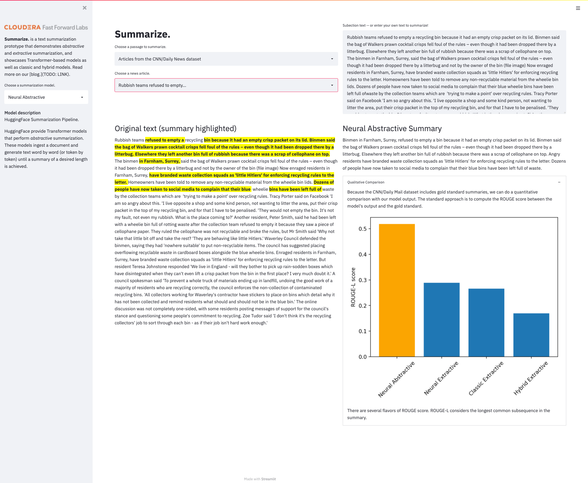

# **Summarize.**
A revamping of the Cloudera Fast Forward Labs Brief application showcasing updated methodology for extractive and abstractive text summarization. 

The primary output of this repository is the **Summarize.** application, a prototype user interface for automatic text summarization. It includes the ability to apply both abstractive and extractive summarization models on various types of documents, including Wikipedia articles, news articles, and fiction book chapters. 




## **Summarize.** interface
Instructions are given both for general use (on a laptop, say), and for Cloudera CML and CDSW. We'll first describe what's here, then go through how to run everything.

### Structure
```
.
├── apps        # Small Streamlit application.
├── cml         # This folder contains scripts that facilitate the project launch on CML.
├── data        # This folder contains starter data.
├── models      # This folder contains a serialized neural extractive summarization model.
└── summa       # A small library of useful functions.
```
There are also `images` and `tests` directories that can be ignored. Let's examine each of the important folders in turn.

### apps
The application accompanying this project comes with a launcher script to assist launching an Application with CDSW/CML. To launch the application in another environment, see instructions below. This directory also includes `st_model_wrapper.py`, a file that provides functionality expressly to streamline the usage of four different summarization models in the **Summarize.** application. 

### cml
This script facilitates the automated project setup on CML and is triggered by the declarative pipeline as defined in the `.project-metadata.yaml` file found in the project's root directory.

### summa
```
summa
├── models
│   ├── classic_extractive.py
│   ├── neural_abstractive.py
│   └── neural_extractive.py
├── highlighting.py
├── wiki_parsing.py
└── utils.py
```

This small library includes functionality to support the **Summarize.** application. The bulk of the library is in the `models` subdirectory, wherein we support four types of summarization models. The details on these models can be found in this [related blog post](LINK). The `classic_extractive.py` file supports both the classic TextRank method, as well as a hybrid Transformers+TextRank model. 


## Installation
The code and applications within were developed against Python 3.8.0., and are likely also to function with more recent versions of Python. 

To install dependencies, first create and activate a new virtual environment through your preferred means, then pip install from the requirements file. We recommend:

```
python3 -m venv .venv
source .venv/bin/activate
pip install -r requirements.txt
python -m spacy download en_core_web_sm
```
In CML or CDSW, no virtual env is necessary. Instead, inside a Python 3 session (with at least 2 vCPU / 4 GiB Memory), simply run
```
!pip3 install -r requirements.txt     # notice `pip3`, not `pip`
```

### Launch **Summarize.**
After installation, the **Summarize.** application can be launched locally by running

```
streamlit run apps/summarize-app.py 
```
The application can also be launched programatically as an Application in Cloudera CDSW/CML via the launch script mentioned above. 


## Deploying on CML
There are three ways to launch this project on CML:

* **From Prototype Catalog** - Navigate to the Prototype Catalog on a CML workspace, select the "Summarize." tile, click "Launch as Project", click "Configure Project"
* **As ML Prototype** - In a CML workspace, click "New Project", add a Project Name, select "AMPs" as the Initial Setup option, copy in the [repo URL](LINK), click "Create Project", click "Configure Project"
* **Manual Setup** - In a CML workspace, click "New Project", add a Project Name, select "Git" as the Initial Setup option, copy in the [repo URL](LINK), click "Create Project". Then, follow the installation instructions above.

